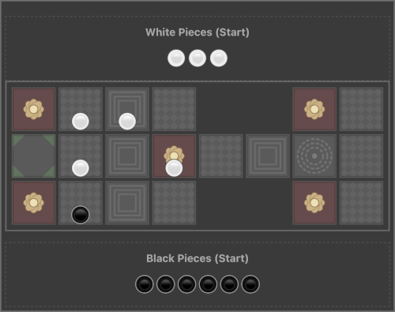

# The Royal Game of Ur
_A React Vite TypeScript PWA Implementation_

<div align="center">
     
</div>

This project is a web-based, single-player implementation of the ancient Mesopotamian board game, **The Royal Game of Ur**, built using React, TypeScript, and Vite. Play against a simple AI opponent and try to race your pieces across the board first!

I created it because I used to enjoy playing it on my old Android phone, but the latest Android versions do not support the APK anymore. I took the opportunity to recreate the game I liked when I wanted to trial _vibe-coding_ using Gemini 2.5 Pro 03-25.

## Features

*   **Classic Gameplay:** Implements my favoured rules of the Royal Game of Ur.
*   **Single Player vs AI:** Play as the Black pieces against an automated opponent playing White.
*   **Unique Dice:** Uses four-sided tetrahedral dice with specific roll probabilities (40% for 2, 20% each for 1, 3, 4).
*   **Board Layout:** Accurately represents the traditional Ur board path, including:
    *   Private starting squares for each player.
    *   Shared central track.
    *   Player-specific side tracks before the return journey.
*   **Special Squares:**
    *   **Rosettes:** Landing on a rosette grants an immediate extra roll.
    *   **Stackable Squares:** Certain squares allow multiple pieces (up to 4) and are safe from capture.
    *   **Private Stackable Square:** One stackable square can only be occupied and stacked by one player at a time.
    *   **Return Journey Safe Square:** The final square is safe from capture only for pieces on their return journey.
*   **Piece Movement:**
    *   Pieces follow distinct outbound and return paths.
    *   Pieces can 'take' opponent pieces on non-safe squares if they land on the same spot and are on the same journey type (outbound/return), sending the taken piece back to the start.
    *   Exact dice roll required to exit pieces off the board.
*   **Stacking Rules:** Only the top piece of a stack can be moved.
*   **Visual Feedback:**
    *   Highlights movable pieces and possible destination cells.
    *   Distinct SVG designs for different cell types (rosette, stackable, etc.).
    *   Animation for piece movement.
*   **PWA Enabled:** Built as a Progressive Web App, potentially installable and usable offline (requires service worker configuration via Vite PWA plugin).

## Tech Stack

*   **Framework:** React 18+
*   **Language:** TypeScript
*   **Build Tool:** Vite
*   **Styling:** CSS (with CSS variables)
*   **Package Manager:** pnpm (but npm or yarn can also be used)

## Getting Started

### Prerequisites

*   Node.js (v18 or later recommended)
*   pnpm (or npm/yarn)

### Installation & Running

1.  **Clone the repository:**
    ```bash
    git clone git@github.com:DavidSint/ur.git
    cd ur
    ```
2.  **Install dependencies:**
    ```bash
    pnpm install # or npm/yarn install
    ```
3.  **Run the development server:**
    ```bash
    pnpm run dev # or npm run dev or yarn dev
    ```
4.  Open your browser and navigate to the local URL provided (usually `http://localhost:5173`).

## How to Play (Briefly)

1.  **Objective:** Be the first player to move all 7 of your pieces off the board.
2.  **Your Turn (Black):**
    *   Click "Roll Dice".
    *   The result (1-4) indicates how many squares you can move a piece.
    *   Clickable pieces (highlighted with a gold border) show your valid moves. Click the piece you want to move.
3.  **Movement:**
    *   Pieces start off-board (-1).
    *   They move along their outbound path, then transition to the return path after passing their final side square.
    *   Landing exactly on the exit square removes the piece.
4.  **Rosettes:** Landing on a rosette grants an immediate extra roll.
5.  **Taking:** Landing on a square occupied by an opponent's piece (on a non-safe, non-stackable square, matching journey type) sends their piece back to the start.
6.  **AI Turn (White):** The AI will automatically roll and make its move.
7.  **Win:** The first player to get all 7 pieces to the finished state wins.

## Contributing

Contributions are welcome! Please feel free to open an issue or submit a pull request.

## License

MIT
